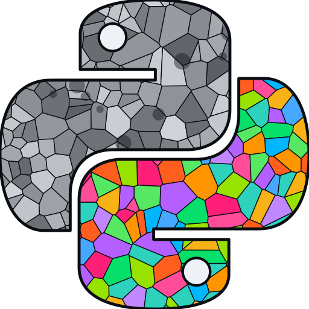

<p align="center">
  
</p>

<h1 align="center">PyReconstruct</h1>

<p align="center">
  <em>Annotate and 3D-reconstruct serial-section and volume electron-microscopy data.</em>
</p>

<p align="center">
  <a href="https://www.gnu.org/licenses/gpl-3.0"></a>
  <a href="https://doi.org/10.1073/pnas.2505822122"></a>
</p>

PyReconstruct is an open-source desktop application for tracing, annotating, and
3D-reconstructing serial-section and volume electron-microscopy (EM) data. It is
the modern, actively maintained successor to *Reconstruct*. The upstream
PyReconstruct project was developed in the Kristen Harris Lab at **The University
of Texas at Austin** and introduced in *PNAS* (2025; see [Credits](#credits) for
full provenance).

This repository is an independently developed and maintained distribution of
PyReconstruct. It tracks the upstream [SynapseWeb/PyReconstruct](https://github.com/SynapseWeb/PyReconstruct)
project and builds on it with substantial performance work, one-click installers,
an in-app updater, and ongoing user-interface modernization.

## Who it's for

Neuroscientists and EM researchers who trace neural structures across stacks of
serial sections — segmenting objects, aligning sections, measuring morphology,
and building 3D reconstructions of cells, organelles, and synapses from
volume-EM datasets. It reads and writes the `.jser` series format and handles
large autosegmented series with hundreds of thousands of traces.

## Install

### One-click installers (recommended)

Download the latest build from
**[Releases](https://github.com/dustenhubbard/PyReconstruct/releases)** — no
Python required:

- **Windows** — `PyReconstruct-<version>-Windows-x86_64-Setup.exe`. Builds are
  unsigned for now; if SmartScreen warns, choose **More info → Run anyway**.
- **macOS (Apple Silicon)** — `PyReconstruct-<version>-macOS-arm64.dmg`, then drag
  PyReconstruct to Applications. Builds are unsigned for now, so the first launch
  is blocked by Gatekeeper — clear the quarantine flag once in Terminal:
  ```
  xattr -dr com.apple.quarantine /Applications/PyReconstruct.app
  ```

Installed builds can update themselves from within the app via **Help ▸ Check for
updates**, on either the **Release** (stable, tagged `vX.Y.Z`) or **Pre-release
(experimental)** (rolling, latest `main`) channel. Updates are downloaded from
GitHub Releases and checksum-verified before they are applied. An optional
once-per-day check on startup is available too, off by default.

### From source (developers)

In a Python 3.11 environment (the project pins `>=3.11,<3.12`):

```
pip install git+https://github.com/dustenhubbard/PyReconstruct
PyReconstruct
```

For a full development setup, see the upstream
[Developers guide](https://github.com/SynapseWeb/PyReconstruct/wiki/Developers)
(it lives on the upstream wiki; clone the fork if you are developing against this
distribution).

## Quickstart

1. Launch the app from your installer, or run `PyReconstruct` on the command line.
2. Open an existing series (a `.jser` file) via **File ▸ Open**, or create a new
   one from a stack of images.
3. Trace structures on each section, adjust the alignment, and open the **3D
   scene** to reconstruct and inspect your objects.

A full installation guide, quickstart, and manuals live on the
[lab wiki](https://wikis.utexas.edu/display/khlab/PyReconstruct+user+guide)
(The University of Texas at Austin) and the
[repo wiki](https://github.com/SynapseWeb/PyReconstruct/wiki),
and in-app under **Help ▸ Online resources**.

## Performance

Large autosegmented series — those with tens to hundreds of thousands of traces —
were previously slow to open and refresh. This distribution rewrites the hot
geometry and serialization paths, with no change to the `.jser` format or the
data model:

- **3–4× faster to open and refresh a series**, measured across real autoseg
  series from 6 MB to 1.4 GB (up to **4.2×** on the fastest case). For example, a
  1.4 GB / 492k-trace series drops from roughly **9.7 minutes to about 3.1
  minutes** to open and refresh.
- **Exact equivalence.** The optimized code produces numerically identical
  geometry to the previous implementation — section, object, and trace counts
  match, and total area / length / radius agree to the floating-point limit. The
  speedup comes from doing the same work faster, not from skipping work.
- **Algorithmic, single-threaded wins** — vectorized per-trace geometry, a lazy
  Feret-diameter (convex-hull) computation, NumPy point mapping, and
  [orjson](https://github.com/ijl/orjson) on the JSON load/save paths. They help
  every machine, and most on the large series that were previously near-unusable.

The benchmark harness, raw results, and the full methodology and equivalence
tables are in **[`benchmarks/`](benchmarks/)** (see
[`benchmarks/REPORT.md`](benchmarks/REPORT.md)), and are reproducible against the
upstream they were forked from.

## Highlights

In the latest tagged release (v1.20.0):

- **One-click installers** for Windows and macOS, built in CI; the macOS build is
  a native Apple Silicon binary on an updated 3D stack (vtk 9.4.2 + vedo 2025.5.4).
- **In-app updater** with Release / Pre-release channels and checksum-verified
  downloads from GitHub Releases.

On the Pre-release (experimental) channel, ahead of the next tagged release:

- **Faster large-series open & refresh** — the performance work above (3–4×, with
  exact geometry equivalence).
- **A correctness test suite** (geometry/transform equivalence, updater logic)
  and a headless performance harness.

Inherited from PyReconstruct: serial-section tracing and annotation, section
alignment, 3D reconstruction and mesh export, Zarr image conversion, quantitative
morphology export, and collaborative, version-controlled series.

> **User interface:** a UI modernization — system light/dark theme following and
> refreshed tool icons — is **in progress** on the `feat/ui-v1` branch and is not
> yet part of a release.

## Bug reports & feature requests

Found a problem, have a feature idea, or want to improve the docs? Please
**[open an issue](https://github.com/dustenhubbard/PyReconstruct/issues)**.
Thanks for the help!

## Credits

PyReconstruct was created by Michael A. Chirillo, Julian N. Falco,
Michael D. Musslewhite, Larry F. Lindsey, and Kristen M. Harris (Kristen Harris
Lab, Department of Neuroscience, Center for Learning and Memory, **The University
of Texas at Austin**) and introduced in *PNAS* (2025; see
[Citation](#citation)). The upstream project lives at
[SynapseWeb/PyReconstruct](https://github.com/SynapseWeb/PyReconstruct). It is the
modern successor to the original **Reconstruct** by John C. Fiala — a
long-standing, Windows-only serial-section reconstruction program.

This distribution is independently developed and maintained by **Dusten Hubbard**
(Kristen Harris Lab, Department of Neuroscience, Center for Learning and Memory,
**The University of Texas at Austin**).

## Citation

If you use PyReconstruct in published work, please cite
[the paper](https://doi.org/10.1073/pnas.2505822122):

```bibtex
@article{Chirillo2025,
	title = {{PyReconstruct}: {A} fully open-source, collaborative successor to {Reconstruct}},
	author = {Chirillo, Michael A. and Falco, Julian N. and Musslewhite, Michael D. and Lindsey, Larry F. and Harris, Kristen M.},
	journal = {Proceedings of the National Academy of Sciences},
	volume = {122},
	number = {31},
	pages = {e2505822122},
	year = {2025},
	doi = {10.1073/pnas.2505822122},
}
```

## License

[GPL-3.0-or-later](LICENSE.md).
